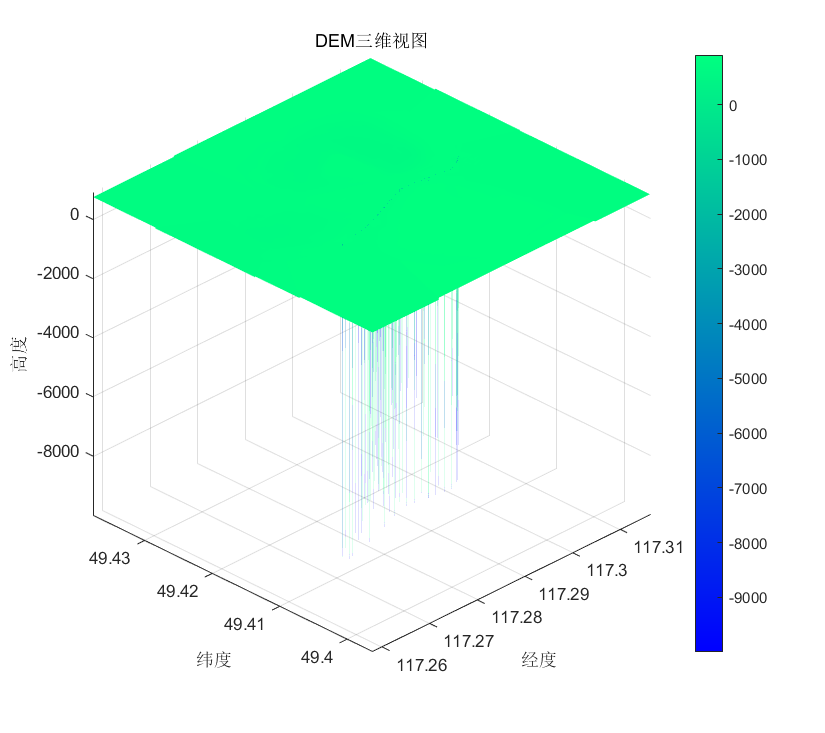
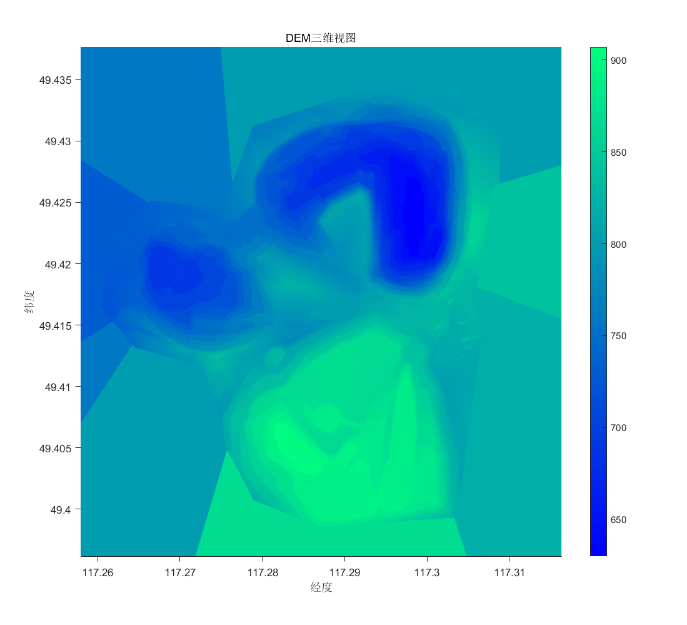
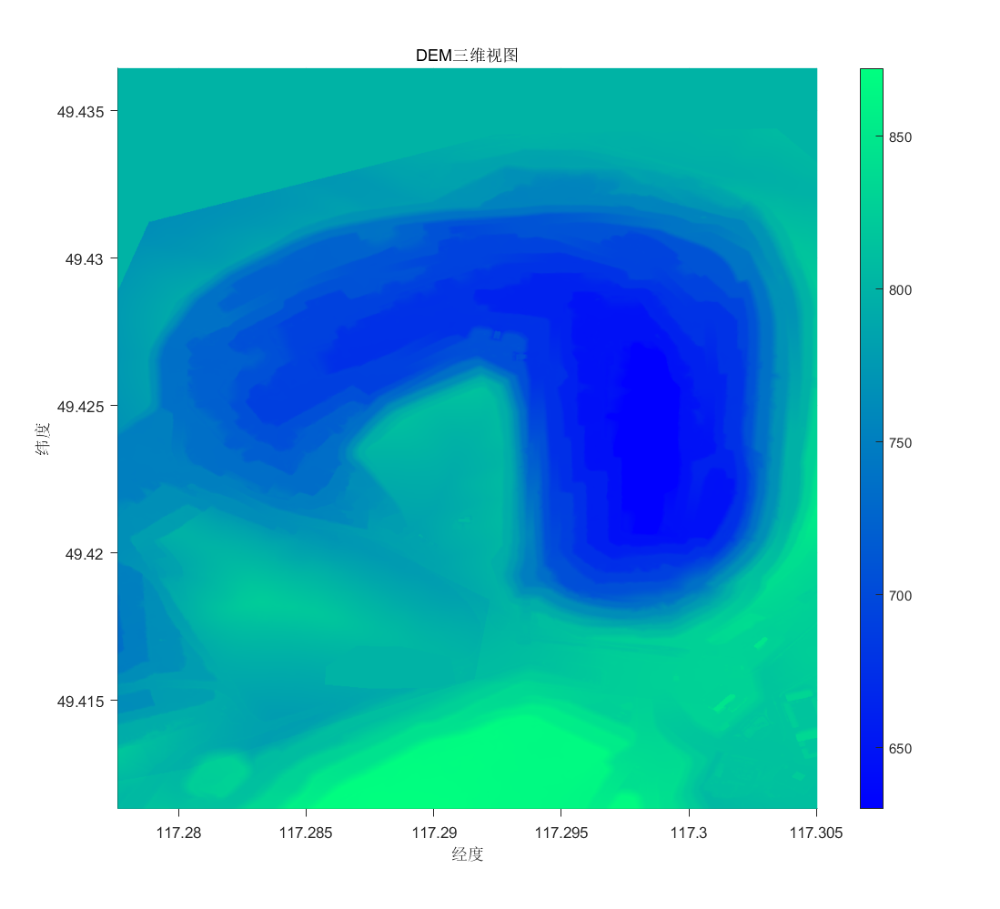
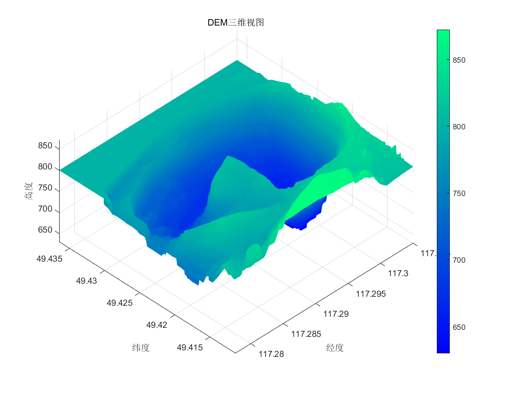
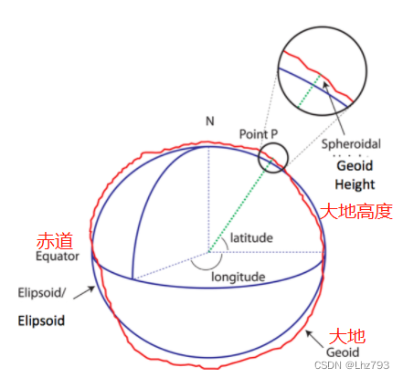

## 地基SAR图像与DEM数据匹配投影

## 概述

地基SAR几何成像模型：

:triangular_flag_on_post:雷达成像仅用$(\theta, \rho)$表示空间坐标，丢弃了高程的信息，最终得到的是仅有方位角和斜距的二维图像（强度或形变）；我们希望将二维图像上每一点的强度值或形变值映射到三维空间中的准确对应点上，以得到最准确的立体观测效果。但很明显，在没有高度信息的条件下，仅根据$(\theta, \rho)$无法直接建立从二维图像到三维空间的准确映射。

但**三维到二维的映射**是简单的，我们可以从带有经纬高的DEM数据出发，结合每个点与雷达的三维坐标关系，测算出对应的$(\theta, \rho)$值，再到雷达二维图像上去匹配，获得整幅地形图到雷达图像的映射关系。

## 具体实践

> 为增强代码的可维护性和可扩展性，已经对整个匹配过程中的代码按照实现功能进行了细粒度的**模块化**，即将具体功能的实现封装在不同的函数以及执行脚本中，尽量使每一环节的功能实现解耦。

目标区域的三维地形：

 

### MATLAB解析DEM对应的tif文件

* **未平滑**

:bulb:*file:* `dem_mzl.tif`

:briefcase:*matlab:* `tif3dDraw.m` | `tifBriefExtract.m`

原始的DEM数据在生成的时候存在许多畸变点，导致高程跨度不准确，目标区域地形趋势模糊，需要做进一步的平滑处理。

* **对畸变点进行均值平滑**

:bulb:*file:* `smooth_dem.tif`

:briefcase:*matlab:* `clipSmooth.m` | `tif3dDraw.m` | `tifBriefExtract.m`

由于畸变点均是离散，依据实际设定阈值可检测出畸变点，随后用临近点的高程数据做均值作为该点高程，达到平滑的效果。上图分别是原始DEM数据的三维显示以及二维垂直投影图像。

### 对平滑后的DEM数据进行裁剪

> 原始DEM数据包含目标区域及其外的一部分区域地形信息，为增强匹配投影的效率，需要先对DEM数据进行裁剪以提取精简的雷达扫描区域的地形信息。

:bulb:*file:* `clip_dem.tif`

:briefcase:*matlab:* `clipSmooth.m` | `tif3dDraw.m` | `tifBriefExtract.m`

按照雷达扫描区域的经纬跨度以及经纬边界，对平滑后的DEM数据进行裁剪；上图为裁剪后得到的精简化的目标三维高程和二维垂直投影图像。

### 裁剪后的DEM数据进行线性插值

> 由于雷达上传的二维图像存在**$818 * 6534 = 5344812\approx534.5w$**个形变点，而裁剪后的DEM数据仅有$1005*1098=1103490\approx110.3w$个地形点位信息，数据量不匹配，直接进行投影映射不能完全利用形变信息，故需对裁剪后的DEM数据在经纬方向上进行插值。

:bulb:*file:* `interp_dem.tif`

:briefcase:*matlab:* `interpolation.m` | `tif3dDraw.m` | `tifBriefExtract.m`

* 插值方式：线性插值（可根据实际地形情况选择二次或三次插值）
* 经度方向插值倍数：4
* 纬度方向插值倍数：6
  （由于单位经纬对应的实际距离有细微差距，在纬度方向提高插值倍数）3
* 插值后DEM数据量：$6025*4389=26443725\approx2644.4w$

插值之后的图像可视化没有发生明显变化，但实际上数据量已经有了20倍的增加。

### MATALB解析雷达形变bin文件

> 在做匹配投影之前首先要获得雷达扫描的二维形变数据，其以二进制的bin文件存储，数据类型为float16类型

:scroll:*file:* `puredefodata.bin`

:pick:*matlab:* `parse_float16.m` --> `rhotheta.mat`

:open_book:*相关知识：*[计算公式](https://blog.csdn.net/ifenghua135792468/article/details/110450243)、[float16与float32](https://blog.csdn.net/leo0308/article/details/117398166)

16bit浮点数的组成：1bit sign（S符号位），5bit exponent（E整数位），10bit mantissa（M小数位）。其计算公式为：

### DEM与二维图像匹配获取映射关系mapper

> 目标监测区域的DEM在短期内是固定的，也就是三维经纬高到二维$(\theta, \rho)$的映射也是不变的；这意味着我们只要对目标区域做一次匹配获取并保存相应的映射关系mapper，其后便可一直使用该mapper去映射投影得到雷达上传的二维形变数据或强度数据在三维地形上的具体情况。

:scroll:*file:* `interp_dem.tif` | `rhotheta.mat`

:pick:*matlab:*  `matchTransform.m` | `coordination_transformation(开源工具)` --> `mapper.mat`

**思路：**经纬高坐标系 --> 大地坐标系(WGS-84) --> 东北天坐标系(ENU) --> $(\theta, \rho)$二维坐标

* DEM数据实际是经纬高数据，结合地球长短轴以及椭球偏心率等信息可将每一个经纬高坐标转换至大地坐标系成XYZ坐标；
* 由大地坐标系XYZ信息，结合雷达中心的XYZ坐标，易推算出DEM中每一点相对于雷达位置的东北天距离，也就是相对于雷达朝东、朝北、以及朝天（高度）的距离差；
* 有了东北天信息，结合雷达扫描图像的起始及结束角度，很容易求出每一点相对于雷达的$(\theta, \rho)$方位角和斜距信息，即完成了匹配映射的过程。

相关知识：[WGS-84 ECEF ENU 坐标系](https://blog.csdn.net/YYshuangshuang/article/details/85099025)

:bookmark:**计算出每一点的$(\theta, \rho)$后，由于雷达$\rho\theta$图中的$\rho$和$\theta$都是离散的，实际上没有一个点能够完全匹配，这时候我们对相应点坐标的选取使用最临近法，即在二维图上选择最靠近计算出来的$(\theta, \rho)$的点作为匹配点。**
**（依据实际效果可选择其他选取方法）**

:bookmark:**获取每一点的$(\theta, \rho)$后，利用雷达扫描的角度边界和距离边界判断该点是否在雷达扫描区域内，若不在，则不保存该点的映射关系，最后可得到最精简的雷达扇形区域的投影映射关系，相对最大程度地提高实时投影映射的时间和效率。**

             

​								经纬高坐标系LLH																		大地坐标系XYZ

### 使用mapper进行投影

> 使用mapper去映射到雷达上传的二维形变或强度图，最终能够获取经纬维度下(不显示高度信息)的形变或强度。

:scroll:*file:*  `rhotheta.mat` | `mapper.mat`

:pick:*matlab:*  `projection.m` --> `test_defo.png`

形变数据未经任何处理直接绘制：（黑点即非0值，左边图像设置了透明通道）

        

这一部分可视化的效果与经数据处理过的形变图有一定区别，是否需要结合强度图来对形变数据做取舍和优化，以及如何处理形变值与呈现的颜色梯度的逻辑关系，仍需老师的指导。
